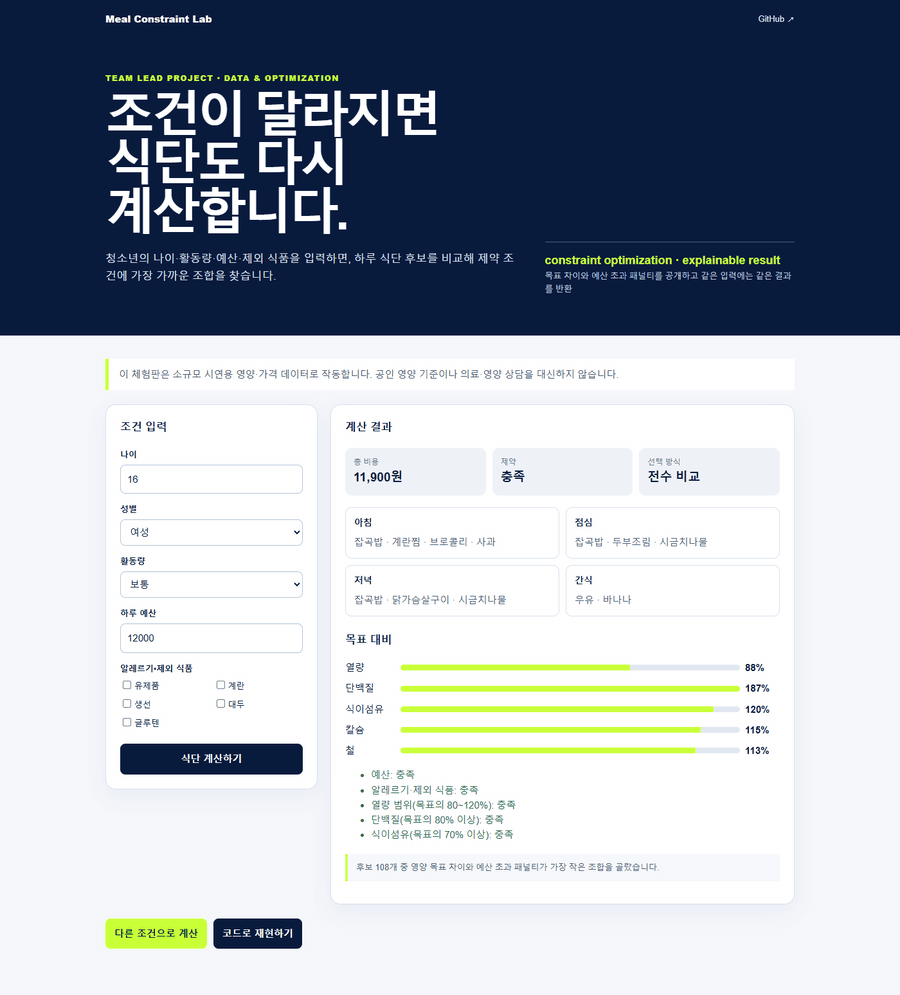

# 청소년 식단 최적화

팀장으로 참여한 데이터 분석·최적화 프로젝트입니다. 나이, 활동량, 예산, 알레르기와 제외 식품을 입력하면 하루 식단 후보를 비교해 제약 조건에 가장 가까운 조합을 찾습니다.

## 작동 화면



### [▶ 브라우저에서 바로 계산해 보기](https://jsm0308.github.io/nutrition_v0/)

조건을 바꾸고 `식단 계산하기`를 누르면 브라우저에서 바로 결과가 달라집니다. 공개 체험판은 설치나 로그인 없이 작동하며, 같은 입력에는 같은 결과를 반환합니다.

> 소규모 시연용 영양·가격 데이터를 사용합니다. 공인 영양 기준이나 의료·영양 상담을 대신하지 않습니다.

## 무엇을 만들었나

1. KDRIs, 국민건강영양조사, NEIS 급식 데이터, 식품 영양 DB를 연결하는 분석 구조를 설계했습니다.
2. 연령별 영양 격차를 비교한 뒤 프로젝트의 대상을 청소년으로 좁혔습니다.
3. 영양 목표, 예산, 알레르기, 제외 식품을 제약 조건으로 표현했습니다.
4. 후보 식단을 비교해 목표 차이와 예산 초과 패널티가 가장 작은 조합을 선택합니다.
5. 총비용, 식단 구성, 영양 목표 대비 비율, 제약 충족 여부를 한 화면에 설명합니다.

## 핵심 문제와 선택

### 처음 정한 대상이 실제로 영양 격차가 가장 큰 집단인지 불분명했다

연령별 권장량과 섭취량의 차이를 다시 비교했고, 영양 불균형이 두드러진 청소년으로 대상을 바꿨습니다. 처음 세운 가설을 유지하기보다 분석 결과에 맞춰 문제를 다시 정의했습니다.

### 식단 추천은 여러 조건이 동시에 걸리는 조합 문제다

음식 선택 여부와 섭취량을 결정 변수로 두고, 영양 기준과 금지 식품을 제약식으로 표현하는 ILP 구조를 설계했습니다. 단순한 유사도 추천보다 “왜 이 조합이 선택됐는지”를 확인할 수 있도록 구성했습니다.

### 원본 데이터와 외부 API가 없으면 포트폴리오에서 실행할 수 없다

공개 체험판에는 15개 식품과 108개 하루 식단 후보를 넣었습니다. 후보 수가 작기 때문에 별도 최적화 패키지 없이 전수 비교하며, 계산식과 한계를 코드에 그대로 공개했습니다. 실제 서비스와 시연용 계산을 구분하기 위한 선택입니다.

대회 당시의 분석, 타깃 변경, ILP 설계는 [`README_PROJECT_ORIGINAL.md`](README_PROJECT_ORIGINAL.md)에 보존했습니다.

## 현재 공개 범위

- 공개 체험판: 나이·성별·활동량·예산·제외 식품 입력, 식단 계산, 결과 설명
- 자동 테스트: 입력 검증, 제외 조건, 결정적 결과, API
- 계산 방식: 열량·단백질·식이섬유·칼슘·철 목표 차이와 예산 초과 패널티 비교
- 미연결: 실제 KDRIs 기준표, NEIS API, 식품영양성분 DB, 학교 재고·가격 데이터

## 로컬에서 재현하기

Python 3.10 이상에서 별도 패키지 설치 없이 실행할 수 있습니다.

```bash
python app.py
```

브라우저에서 `http://127.0.0.1:8103`을 엽니다. 포트를 바꾸려면 `python app.py --port 9000`처럼 실행합니다.

```bash
python -m unittest discover -s tests -v
```

`GET /api/health`와 `POST /api/optimize`를 제공합니다. 실제 급식이나 개인 식단에 적용하려면 공인 기준과 데이터 버전을 고정하고, 영양 전문가 검토와 개인정보 처리 기준을 추가해야 합니다.
